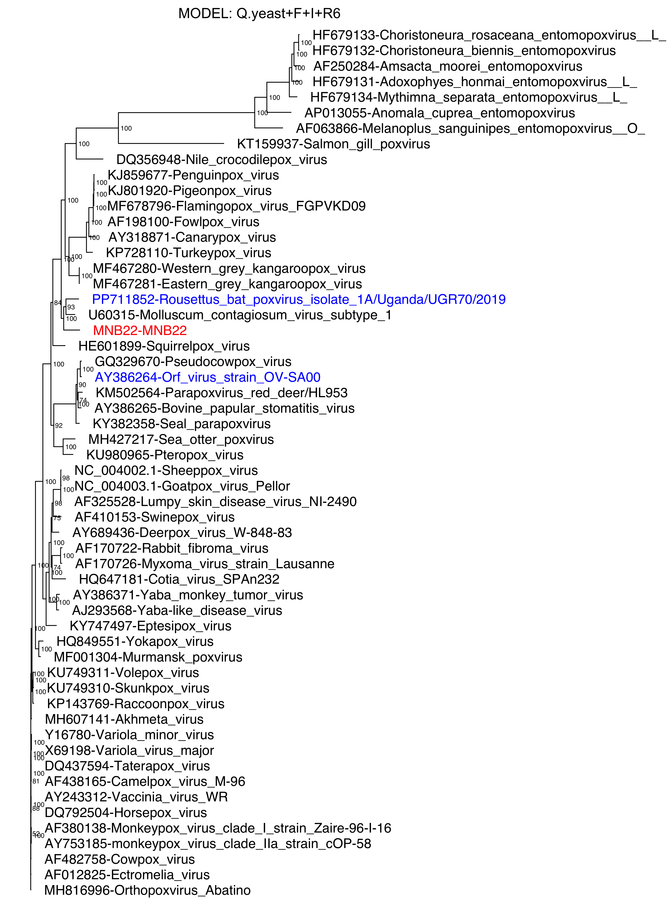

# phylogenetic_analysis_madamurpox_virus

This phylogenetic analysis places a novel poxvirus isolate (madamurpox virus) in the *Poxviridae* family using a merged protein MSA of 25 conserved proteins across 56 diverse isolates spanning the *Poxviridae* family.

# Environment

This analysis was run on a MacBook Pro with M4 Pro chip, 48G RAM, running Mac OSX Tahoe 26.2.

## Pre-requisites:
  * MUSCLE v5.4 [https://github.com/recdgar/muscle](https://github.com/rcedgar/muscle/releases/tag/v5.3) installed as ~/Applications/muscle-osx-arm64.v5.3
    * MUSCLE requires gcc be installed: Either ```xcode-select --install``` or  ```brew install gcc@11```
  * iqtree2 v2.4.0 [https://github.com/iqtree/iqtree2](https://github.com/iqtree/iqtree2/releases/tag/v2.4.0) installed as ~/Applications/iqtree2 
  * BLAST 2.17.0+ ```brew install blast```
  * SAMtools 1.22.1 ```brew install samtools```
  * seqtk 1.5-r133 ```brew install seqtk```
  * snakemake 9.14.1 ```brew install snakemake```
  * R 4.5.2 (2025-10-31) ```brew install R```
    * with the following packages installed: ape, ggtree, ggplot2
    * try ```Rscript -e "options(repos='https://cloud.r-project.org'); install.packages(c('ape','ggplot2','BiocManager')); BiocManager::install('ggtree', ask=FALSE, update=FALSE)"```
  * pdfunite 25.12.0 ```brew install poppler``` used to merge PDFs files into one big one

## Quick Start

```
# copy down code and data
git clone https://github.com/LefkowitzBioinformatics/phylogenetic_analysis_madamurpox_virus.git
cd phylogenetic_analysis_madamurpox_virus

# check environment
./00.set_env.sh -v

# run pipeline (~2 hours: runs iqTree2 ModelFinder Plus (MFP))
./99.full_run.sh
```

# Metadata & Data Setup

## protein_lists/

The primary file is
  * [core_proteins.curated.xlsx](protein_lists/core_proteins.curated.xlsx)
Which contains worksheets:
      * "Genomes" list of genomes (accessions, names, inclusion status, etc)
      * "CoreProteinGroups" name and function of each protein homolog group, and their canonical order
      * "AllProteins" lists the protein_id for all the homologs in each protein group in each genome.
      * "QC Pivot" checks that "AllProteins" is filled in consistently.

The derived file is, which is actually used by the scripts is
  * [AllProteins.txt](protein_lists/AllProteins.txt)
which is the worksheet of the same name from the .xlsx file, saved as .txt (TAB separated). 

To add an additional genome(s):
   * add rows for the genome(s) to core_proteins.curated.xlsx[Genomes].
   * add rows for the protein homologs in those genomes to core_proteins.curated.xlsx[AllProteins].
   * add *.faa files to [src_sequences/](src_sequences/).
   * update "# sources" section of [01.build_protein_db.sh](01.build_protein_db.sh) to include the new .faa's.  
   * export a AllProteins workbook at "Tab delimited Text (.txt)" into AllProteins.txt, and re-run the pipeline. 

## src_sequences/

A collection of protein sequences from many Poxviridae genomes. This may include a lot of proteins that wont be used in the current alignments. The selection of which proteins are included in the alignment is driven by the protein_lists/[AllProteins.txt](protein_lists/) file.

### genbank/

Additional genomes, downloaded from NCBI.

If proteins are missing or incorrectly annotated in the genbank records, then additional, hand-build files my provided additional or corrected proteins, with distinct protein_ids. 

### ictv_report/

Protein sequences used to build the *Poxviridae* phylogenetic trees in the ICTV Report *[Poxviridae]*(https://ictv.global/report/chapter/poxviridae/poxviridae) chapter, with some later updates. 

See [https://ictv.global/report/chapter/poxviridae/poxviridae](https://ictv.global/report/chapter/poxviridae/poxviridae)

### madamurpox_isolate_MNB22_067_17/

Proteins annotated in the novel poxvirus isolate under study.

# Protocol

## 00.set_env.sh

Validate that all paths for programs listed here are correct.

## 01.build_protein_db.sh

Build a single fasta with the full set of available protein sequences from src_sequences/

## 02.build_protein_faa.sh

Extract all the listed homologous sequences and build a .faa for each protein group that contains all the homologs for the selected genomes.

## 03.align.sh

Using a Snakemake pipeline, use MUSCLE to align each protein homolog group individually.

## 04.merge_protein_aligns.sh

Merge the individual protien group MSA's in the defined protein group order to create a merged MSA.

## 05.build_tree.iqtree.sh

Determine the best model, using iqtree2/MFP and build phylogenetic trees for that model and some pre-selected models.

## 06.build_protein_trees.sh

Iterate over the protein groups, using iqtree2 and a pre-selected model, to build an independent phylogenetic tree for each protein. These can then be reviewed and compared against the tree from the merged MSA.

## 99.full_run.sh

Convenience script that runs all the above scripts, in order.

# Results

Final merged MSA: 
  * [new_align](new_align)/[merged_proteins.msa-muscle.faa](new_align/merged_proteins.msa-muscle.faa)

Final merged MSA iqTree2 tree file: 
  * [new_align](new_align)/[iqtree.Qyeast_F_I_R6](new_align/iqtree.Qyeast_F_I_R6)/[merged_proteins.msa-muscle.faa.Qyeast_F_I_R6.treefile](new_align/iqtree.Qyeast_F_I_R6/merged_proteins.msa-muscle.faa.Qyeast_F_I_R6.treefile)

Rough visualization of tree file: 
  * [new_align](new_align)/[iqtree.Qyeast_F_I_R6](new_align/iqtree.Qyeast_F_I_R6)/[merged_proteins.msa-muscle.faa.Qyeast_F_I_R6.treefile.pdf](new_align/iqtree.Qyeast_F_I_R6/merged_proteins.msa-muscle.faa.Qyeast_F_I_R6.treefile.pdf) [](new_align/iqtree.Qyeast_F_I_R6/merged_proteins.msa-muscle.faa.Qyeast_F_I_R6.treefile.pdf)


